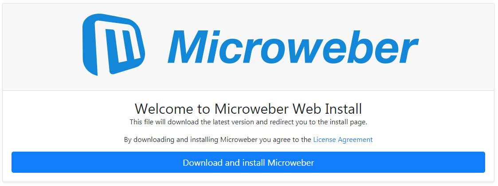

# Microweber Web Installer

This file will download the latest version of Microweber CMS and redirect you to the install page

## How to use:

- Upload to your web server
- Visit the address where you uploaded the file
- Follow the instructions on the install screen

